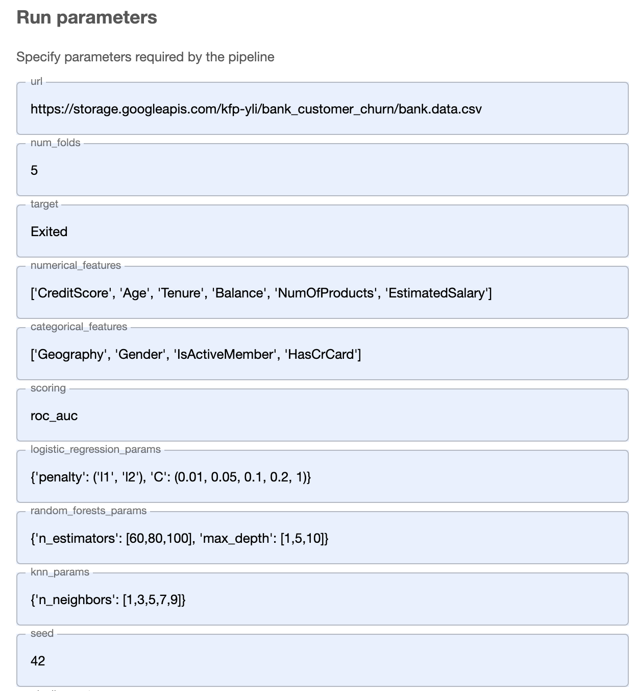
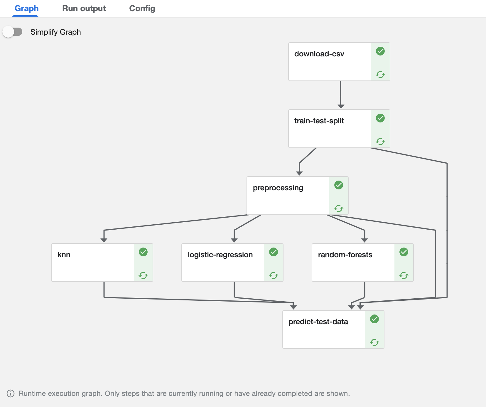

# bank-customer-churn-prediction

## A supervised machine learning project done with Kubeflow Pipeline

This repository store a simple ML classification project which I used to show how to leverage Kubeflow Pipeline to orchestrate a ML pipeline.

- This project features a classification problem, where we need to predict whether a given bank customer is likely to close their bank account or not.

- The EDA notebook shows explorative data analysis of the dataset. The dataset has both categorinal features and numerical features, and the target to be predicted is a binary label. Correlations between the features and the target as well as between the features themselves are analyzed in the EDA.

- The pipeline is constructed with the following components:

  - **Download:** The dataset is stored oneline. We initiate the pipeline by downloading it from the url and store it in a volume that our pipeline can have access to (in this case, I stored it in my Google Cloud Storage bucket).

  - **Train test split:** We split the dataset into training and test datasets (8:2). The test dataset serves as a holdout set and will be used to evaluate our model performance in the end.

  - **Data preprocessing:** Since the dataset has both categorical and numerical features. Before feeding them to a model, we first one-hot encode the categorical features and standardize the numerical features to keep them on the same scale. The `OneHotEncoder` and `StandardScaler` are fit to the training dataset, and then saved so that we can use them to transform the test dataset later on.

  - **Model training:** We train 3 base line models on the preprocessed training data - Logistic Regression, K Nearest Neighbors, and Random Forests. We perform a cross validation with each model and use Grid Search to find the optimal hyperparameters for the model. We can visualized the selected [evaluation metrics](./screenshots/knn_metrics.png) for each model

  - **Make predictions on the test dataset:** Finally, we use one of the three models that gives the best performance to predict the test dataset, and output evaluation metrics. But before making the predictions, don't forget to first preprocess the test dataset using the previously saved `OneHotEncoder` and `StandardScaler`.

The pipeline can be compiled with the command `python make_pipeline.py`. A notebook version is also included in the repository.

## Use the pipeline

This pipeline can be generalized to any similar tabular dataset. The user-defined parameters are list below.

## Graph picture of the pipeline

## Docker

Kubeflow Pipeline is run on Kubernetes and each component is run within an individual container. In this project, all components use the same base docker image. A simple Dockerfile is included in `base_image_docker/`.
